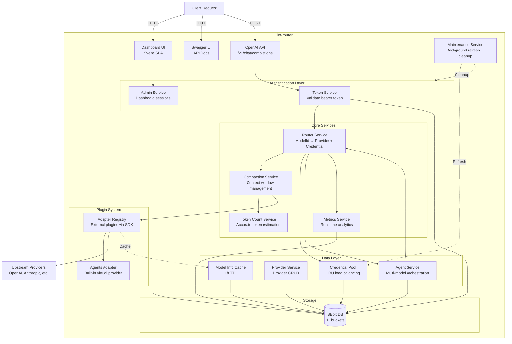

# llm-router

A **zero-bloat**, self-contained OpenAI-compatible LLM routing gateway with intelligent load balancing, automatic context management, and real-time metrics.

```bash
llm-router localhost -p 8080 --db ./router.db
```

---

## For AI Agents

See [README-CLAUDE.md](README-CLAUDE.md) for coding guidelines and rules when working on this project.

---

## Philosophy

| Principle | How |
|-----------|-----|
| **Zero external dependencies** (runtime) | Only `cobra` (CLI) + `bbolt` (embedded DB) |
| **Minimal configuration** | CLI flags + optional `adapters.conf` for plugins |
| **Easy to extend** | External plugin system via SDK |
| **Self-sufficient** | Single binary, embedded UI, embedded DB |

---

## Architecture



---

## Key Features

### Intelligent Context Management

The **Compaction Service** automatically manages conversation context to fit within model limits:

- **Automatic compaction** when conversation exceeds 85% of context window
- **Intelligent message prioritization** (system/highest/high/mid/low/lowest/garbage)
- **"Shout" detection** for IMPORTANT, CRITICAL, URGENT markers
- **Truncatable content detection** for code blocks and long messages
- **Three compaction states**: kept, trim 25%, trim 10%, drop

Uses **slop-tokenizer** for accurate token counting across OpenAI (o200k_base, cl100k_base) and Anthropic (claude) encodings.

### Real-Time Metrics

The **Metrics Service** provides comprehensive observability:

- **Non-blocking event recording** (10k buffer)
- **1-minute aggregation buckets** with automatic compression (30m→2h→6h)
- **90-day retention** with automatic cleanup
- **Tracks**: requests, errors, tokens (input/output), duration
- **Dimensions**: provider, model, token, error type
- **Time ranges**: hour, 1d, 7d, 28d, 90d, month

Access via dashboard at `/api/llm-router/dashboard/metrics/*`.

### Credential Load Balancing

Intelligent credential rotation to avoid rate limits:

- **LRU Selection**: Least-recently-used credentials prioritized
- **4-tier priority ordering**: Never-used (0) → Normal (1) → Quota-exceeded (2) → Expired (3)
- **Intelligent retry**: Automatic rotation on rate limit (429)
- **Exponential backoff**: 1s→2s→4s→8s→16s→32s→64s when all credentials exhausted
- **Automatic recovery**: Quota-exceeded credentials recover after reset time

Configure retry cycles with `--max-retries` flag (default: 7).

---

## Services

| # | Service | Package | Responsibility |
|---|---------|---------|----------------|
| 0 | **Bootstrap UI** | `dashboard` | First-run admin account creation |
| A | **Dashboard** | `dashboard` | Admin UI for system overview, providers, agents, tokens, and credentials |
| B | **Swagger UI** | `dashboard` | Interactive API documentation at `/swagger/` |
| C | **OpenAI API** | `api/v1` | `/v1/chat/completions`, `/v1/models` |
| 1 | **Token Service** | `services/token` | Issue / validate / revoke router-tokens |
| 2 | **Router Service** | `services/router` | Resolve ModelId → Adapter + Credential with LRU selection and intelligent retry |
| 3 | **Provider Service** | `services/provider` | CRUD for Provider records |
| 4 | **Credential Pool** | `services/credential` | Store, retrieve, update credentials with LRU-based load balancing |
| 5 | **Agent Service** | `services/agent` | CRUD for Agent records with validation and circular dependency prevention |
| 6 | **Auth Service** | `services/auth` | Ephemeral state for auth flows (10min TTL) |
| 7 | **Compaction Service** | `services/compaction` | Automatic conversation compaction to fit context windows |
| 8 | **Token Count Service** | `services/tokencount` | Accurate token counting using slop-tokenizer |
| 9 | **Metrics Service** | `services/metrics` | Real-time metrics collection with 90-day retention |
| 10 | **Model Info Service** | `services/modelinfo` | Model metadata caching (1h TTL) with in-flight deduplication |
| 11 | **Maintenance** | `services/maintenance` | Background credential refresh + auth flow cleanup |

---

## Usage

### Quick Start

```bash
# First run - starts the bootstrap UI at localhost:8080
make run

# Or build and run manually
make build
./llm-router localhost -p 8080 --db ./router.db
```

Then:

1. Open `http://localhost:8080` → Create admin account
2. Dashboard → **Overview** → Review system statistics and metrics
3. Dashboard → **Providers** → Add a provider (e.g. type `demo`)
4. Dashboard → **Credentials** → Click "Add New Credential" → Select provider → Follow wizard
5. Dashboard → **Agents** → Create an agent to orchestrate multiple models (optional)
6. Dashboard → **Tokens** → Issue a router token, note the secret value
7. **Swagger UI** → Visit `http://localhost:8080/swagger/` for interactive API documentation
8. Use the token with any OpenAI-compatible client:

```bash
curl http://localhost:8080/v1/chat/completions \
  -H "Authorization: Bearer <your-router-token>" \
  -H "Content-Type: application/json" \
  -d '{
    "model": "demo/hello-model",
    "messages": [{"role": "user", "content": "Hello!"}]
  }'
```

### API Endpoints

#### OpenAI-compatible API
| Endpoint | Description |
|----------|-------------|
| `POST /v1/chat/completions` | OpenAI-compatible chat completions (streaming & non-streaming) |
| `GET /v1/models` | List available models based on token rules |

#### Dashboard & Admin
| Endpoint | Description |
|----------|-------------|
| `GET /` | Dashboard UI (Svelte SPA) |
| `GET /swagger/` | Interactive API documentation (Swagger UI) |
| `GET /api/llm-router/status` | System status |
| `POST /api/llm-router/login` | Admin login |
| `POST /api/llm-router/logout` | Admin logout |
| `POST /api/llm-router/bootstrap` | Create initial admin account |

#### Providers & Credentials
| Endpoint | Description |
|----------|-------------|
| `GET /api/llm-router/dashboard/providers` | List all providers |
| `GET /api/llm-router/dashboard/adapter-types` | List available adapter types |
| `GET /api/llm-router/dashboard/providers/stats` | Provider statistics |
| `GET /api/llm-router/dashboard/credentials` | List all credentials |
| `DELETE /api/llm-router/dashboard/credentials/{id}` | Delete credential |
| `POST /api/llm-router/dashboard/auth/start` | Initiate provider auth flow |
| `POST /api/llm-router/dashboard/auth/callback` | Handle auth flow callbacks |

#### Tokens
| Endpoint | Description |
|----------|-------------|
| `GET /api/llm-router/dashboard/tokens` | List router tokens |
| `POST /api/llm-router/dashboard/tokens` | Create token |
| `PUT /api/llm-router/dashboard/tokens/{id}` | Update token rules |
| `DELETE /api/llm-router/dashboard/tokens/{id}` | Delete token |
| `GET /api/llm-router/dashboard/tokens/usage` | Token usage statistics |

#### Agents
| Endpoint | Description |
|----------|-------------|
| `GET /api/llm-router/dashboard/agents` | List all agents |
| `POST /api/llm-router/dashboard/agents` | Create agent |
| `GET /api/llm-router/dashboard/agents/{id}` | Get agent by ID |
| `PUT /api/llm-router/dashboard/agents/{id}` | Update agent |
| `DELETE /api/llm-router/dashboard/agents/{id}` | Delete agent |
| `GET /api/llm-router/dashboard/agents/available-models` | List models for agent configuration |

#### Metrics
| Endpoint | Description |
|----------|-------------|
| `GET /api/llm-router/dashboard/metrics/overview` | Aggregated metrics overview |
| `GET /api/llm-router/dashboard/metrics/timeseries` | Time-series data for charts |
| `GET /api/llm-router/dashboard/metrics/models` | Distinct models from metrics |

#### Models
| Endpoint | Description |
|----------|-------------|
| `GET /api/llm-router/dashboard/models` | Fetch models by provider IDs |

---

## Key Concepts

### ModelId

Format: `provider/model-name[:version]`

```
openai/gpt-4o
anthropic/claude-3-opus:20240229
ollama/llama3
agents/my-agent
```

The prefix (`openai`, `anthropic`, `agents`, etc.) maps directly to the **adapter TypeKey** used to look up the right provider adapter.

### Agents

**Agents** are virtual models that orchestrate requests across multiple real providers with custom instructions and intelligent routing.

Format: `agents/agent-name`

```
agents/research-assistant
agents/code-reviewer
```

**Key Features:**
- **Multi-model orchestration**: Define a list of models to try in priority order
- **Instruction injection**: Add system prompts at the beginning or end of conversations
- **Model-specific instructions**: Fine-tune instructions for each model
- **Decision-based routing**: Use a cheap model to intelligently select the best model for each request
- **Automatic fallback**: On rate limits, automatically tries the next model in priority order

**Example Use Case:**
```json
{
  "name": "Research Assistant",
  "models": [
    {
      "model_id": "openai/gpt-4o",
      "priority": 0,
      "description": "Best for complex reasoning and analysis"
    },
    {
      "model_id": "openai/gpt-4o-mini",
      "priority": 1,
      "description": "Fast and cost-effective for simple tasks"
    }
  ],
  "instructions": {
    "content": "You are a research assistant. Provide detailed, well-sourced answers.",
    "injection": "beginning"
  },
  "decision_model": {
    "model_id": "openai/gpt-4o-mini",
    "system_prompt": "Choose the best model based on query complexity."
  }
}
```

**Usage:**
```bash
curl http://localhost:8080/v1/chat/completions \
  -H "Authorization: Bearer <your-router-token>" \
  -H "Content-Type: application/json" \
  -d '{
    "model": "agents/research-assistant",
    "messages": [{"role": "user", "content": "Explain quantum computing"}]
  }'
```

### Token Disambiguation

There are **two completely separate token systems**:

| Token | Where used | Managed by |
|-------|-----------|------------|
| **Router Token** | `Authorization: Bearer <token>` on `/v1/` API | Token Service |
| **Provider Credentials** | `api_key`, `access_token`, etc. sent to upstream | Credential Pool |

Router Tokens are _our own_ bearer tokens. Provider Credentials are what we use to call upstream LLMs.

### Token Rules

Each Router Token carries a `TokenRules` struct:

```json
{
  "allowed_models": ["openai/gpt-4o", "anthropic/claude-3-opus"]
}
```

Empty `allowed_models` = **all models permitted**.

---

## Compiling Locally

### Requirements

The following tools must be installed and available in your PATH:

- **make** - GNU Make (or use `make.ps1` on Windows)
- **go** - Go 1.22 or later
- **git** - Git for Windows (includes Unix tools on Windows)
- **npm** - Node.js package manager
- **zip** - Archive utility

**Windows users**: Use `.\make.ps1` instead of `make`. The script automatically resolves Git's Unix tools (bash, printf, mkdir, etc.) and prepends them to PATH.

**Installation via Scoop (Windows)**:
```powershell
scoop install make zip go git nodejs
```

### Building

```bash
# Run locally (builds frontend, generates docs, runs server)
make run

# Build for current platform
make build

# Build release for all platforms
VERSION=1.0.0 make release
```

### Plugin System via adapters.conf

External adapters are managed through `adapters.conf` at the project root:

**Format**: `<module-path> <module-query>`

**Example**:
```
# External adapter registry
github.com/TheSlopMachine/llm-router-adapter-demo main
github.com/user/my-adapter v1.2.0
github.com/user/another-adapter abc123def456
```

**How it works**:
1. List external adapter modules in `adapters.conf`
2. Run `make generate-plugins` (automatically called by `make build`)
3. Makefile runs `go get <module>@<module-query>` for each entry
4. Generates `plugins/plugins.go` with blank imports
5. Adapters self-register via `init()` calling `sdk.Register()`

Using `main` fetches the current tip of the `main` branch. Go still records the resolved result as a pseudo-version in `go.mod`, so rerun `go get ...@main` or `make generate-plugins` when you want to advance to newer commits.

**Makefile commands**:
```bash
# Add an adapter
make add-adapter MODULE=github.com/user/adapter QUERY=main

# List configured adapters
make list-adapters

# Remove an adapter
make remove-adapter MODULE=github.com/user/adapter
```

---

## Developing Adapters

Adapters are now developed as **external Go modules** using the **llm-router-sdk**.

### SDK & Reference Implementation

- **SDK**: [github.com/TheSlopMachine/llm-router-sdk](https://github.com/TheSlopMachine/llm-router-sdk)
  - Public API contract for llm-router adapters
  - Defines `Adapter` interface and error types
  - Provides registration mechanism

- **Demo Adapter**: [github.com/TheSlopMachine/llm-router-adapter-demo](https://github.com/TheSlopMachine/llm-router-adapter-demo)
  - Reference implementation demonstrating adapter interface
  - Comprehensive documentation and examples
  - Shows auth flow, credential validation, and error handling

### Quick Overview

Create a new Go module implementing the SDK's `Adapter` interface:

```go
package myadapter

import "github.com/TheSlopMachine/llm-router-sdk"

func init() {
    sdk.Register(&Adapter{})
}

type Adapter struct{}

func (a *Adapter) TypeKey() string { return "myprovider" }
func (a *Adapter) AuthType() sdk.AuthType { return sdk.AuthTypeAPIKey }
func (a *Adapter) ValidateCredentials(data map[string]string) error { /* ... */ }
func (a *Adapter) Complete(ctx, cred, req) (*sdk.ChatCompletionResponse, error) { /* ... */ }
func (a *Adapter) CompleteStream(ctx, cred, req, w) error { /* ... */ }
func (a *Adapter) NeedsRefresh(cred) bool { return false }
func (a *Adapter) RefreshCredential(ctx, cred) (*sdk.Credential, error) { return nil, sdk.ErrNoRefreshNeeded }
func (a *Adapter) GetAuthFlow() sdk.AuthFlowHandler { return nil }
func (a *Adapter) GetModelInfos(ctx, cred, qualifier) ([]sdk.ModelInfo, error) { /* ... */ }
func (a *Adapter) GetDefaultProviders() []sdk.ProviderInfo { /* ... */ }
```

Then add it to `adapters.conf` and rebuild.

### Authentication Flow (Optional)

Implement `GetAuthFlow()` to enable wizard-based credential acquisition in the dashboard. Instead of users manually entering JSON credentials, they can authenticate through a guided flow (API key input, OAuth, multi-step auth, etc.).

See the demo adapter for comprehensive documentation and examples.

---

## Tech Stack

| Layer | Choice |
|-------|--------|
| CLI | `spf13/cobra` |
| HTTP Server | Go stdlib `net/http` (1.22+ routing) |
| Embedded DB | `go.etcd.io/bbolt` (pure Go, zero CGO) |
| Serialisation | Go stdlib `encoding/json` |
| Frontend | Svelte SPA |
| API Documentation | Swagger/OpenAPI 2.0 via `swaggo/swag` |
| Token Counting | `github.com/TheSlopMachine/slop-tokenizer` |
| Adapter Interface | `github.com/TheSlopMachine/llm-router-sdk` |

---

## Database Structure

**Database**: BBolt (embedded key-value store)

| Bucket | Purpose |
|--------|---------|
| `meta` | Bootstrap state |
| `admin` | Admin accounts (bcrypt hashed passwords) |
| `tokens` | Router tokens (hash stored, not raw) |
| `token_index` | Fast token lookup via hash |
| `providers` | Provider records (composite ID: "openai" or "openai:azure") |
| `credentials` | Provider credentials with usage stats and LRU tracking |
| `auth` | Ephemeral auth flow state (10min TTL) |
| `model_info` | Model metadata cache (1h TTL) |
| `sessions` | Dashboard sessions (8h normal / 30d remember-me) |
| `metrics` | Time-series metrics data (90-day retention) |
| `agents` | Agent configurations with optimistic locking |

---

## License

MIT
